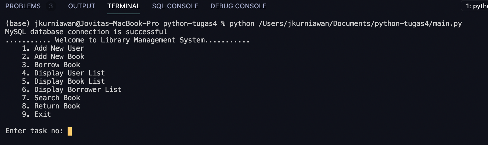

# Python Project: Library Management System (LMS)

### A. Background

Library management system is a program to store library information. The system is used to support operational day-to-day activities at a physical library. For instance, adding new library member information, keeping tracks of book and borrowers information. 

### B. Tools
Languages: 
* Python
* SQL 

Libraries: 
* Mysql connector
* Random
* Tabular

### C. Objective

Learning objective: 
* Create LMS using Python
* Connecting Python program to MySQL database 
* Using OOP to create Python program
* Appy PEP8 principles to write clean Python program 

Program objective: 
* Adding new user information to LMS
* Adding new book information to LMS 
* Adding new borrower information to LMS
* Displaying user, book, borrower lists on LMS
* Search for a book on LMS
* Updating information to LMS when a book is returned 

### D. Program Description 

1. Create SQL Database on MySQL Workbench
    * Create DB named "db_lms" containing 3 tables
    * Table 1 - tb_user: Contain user information 
    * Table 2 - tb_book: Contain book information
    * Table 3 - tb_borrower: Contain borrower information 
    * Output: db_lms.sql file

_Diagram 1: table design_

_Diagram 2: ERD for DB LMS_

2. Create Python Program 
    * Step 1: Import relevant modules (tabular, random, mysql connector)
    * Step 2: Establish connection with MySQL Workbench
    * Step 3: Create functions for each features 
    _Digram 3: Function Planning_
    
    * Output: main.py file 

### E. Guide to Try It Yourself 

1. Clone/downlaod this git repository into your local computer. It should contain:
    
2. Open main.py file > change sql password information. Refer to screenshot below:
    
3. Open terminal > go to git repository file on your local computer
4. Execute "python main.py" file on your terminal. Refer to screenshot below:
    

### F. Test Cases & Results

__Test case 1: Add New User__
1.A: Input New User Data 
    
1.B: Display User List 
    

__Test case 2: Add New Book__
2.A: Input New Book Data
    
2.B: Display Book List 
    

__Test case 3: Borrowing a Book__ 
3.A: Input New Borrower Data
    
3.B: Display Borrower List 
    
3.C: Stock Deducted After Borrowing  
    
    
__Test case 4: Returning a Book__ 
4.A: Input Returned Book and User Data
    
4.B: Display Borrower List after Returned (Delete Borrower Info)
    
4.C: Stock Added After Books are Returned 
    

__Author__
Copyright (c) _2022_ _Jovita Kurniawan_